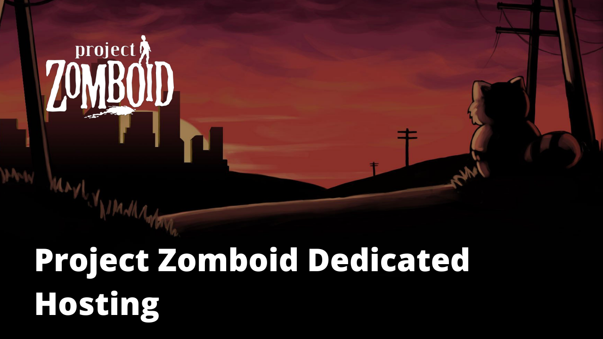

# Project Zomboid Dedicated Hosting

**[WATCH THE VIDEO TUTORIALS](https://www.youtube.com/playlist?list=PLaG-iNIh0Iu7CUEo_DGVUOvG0I_OfWO9X)**

## What is this?
This repository contains code for setting up your Project Zomboid dedicated server through cloud services (like AWS) effortlessly. 

## Getting started
1. When setting an EC2 instance, copy the items inside `user-data.sh` when configuring your server
2. Once the boot-up process is finished (all files inside server-setup folder are there), run the `run-server.sh` script
3. Kill your server
4. Run `copy-settings.sh` (to copy over custom server specs in the specs folder)
5. Run `run-server.sh` again to restart the server

## Motivation
Project Zomboid comes with its own hosting feature built into the client. However, it relies on one player to become the "host". This would mean that the "host" player is the only one with the power to start and stop the server. If they're away, then nobody else can play. I always found this frustrating. My girlfriend holds the files for our server. I couldn't run the server when she isn't around. This is why PZ offers a dedicated server as a solution to this problem.

There are *tonnes* of dedicated hosting solutions out there; however, they can be very costly; especially when you don't even play PZ that much.

Setting up a server requires a lot of technical expertise and can be daunting to those without experience with cloud providers or other hosting services.

I was inspired by the effortless experience that Minecraft players have for their servers. The process for players is to simply register to a website, give their servers a name and configuration and press a big "start" button to create their server. I want that same experience for PZ players. 

I'm not completely sure how i'll achieve this, but that's what this is for. Feel free to join me in this journey.

## Roadmap (so far)

Find my [roadmap here](https://github.com/users/chrisrabe/projects/2/views/1)